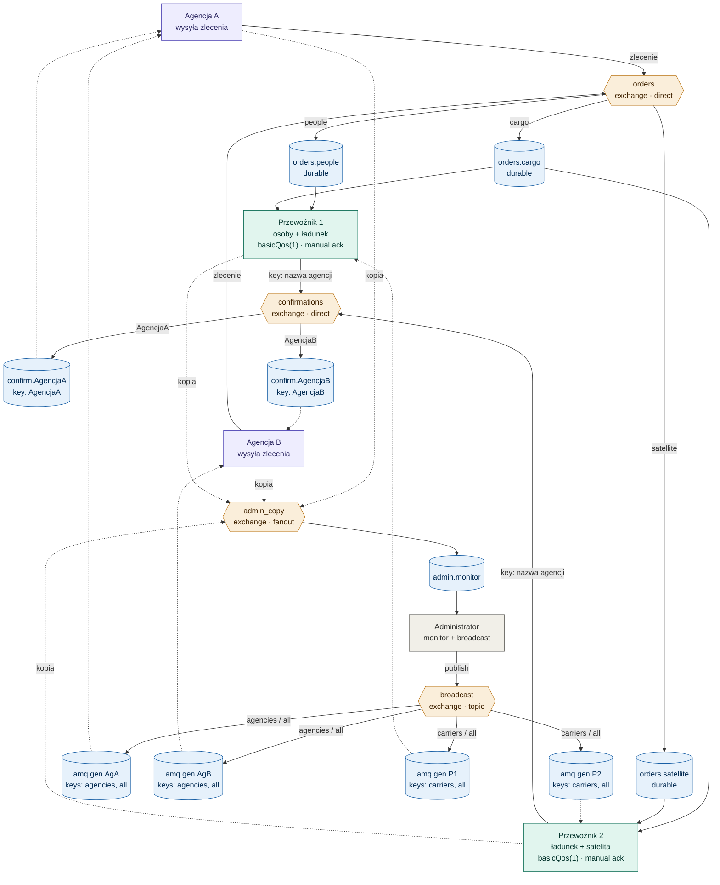

# System transportu kosmicznego — RabbitMQ

System pośredniczący między agencjami kosmicznymi a przewoźnikami świadczącymi usługi transportu kosmicznego (przewóz osób, przewóz ładunku, umieszczanie satelitów na orbicie).

## Wymagania

- RabbitMQ na `localhost:5672` (domyślne ustawienia)
- Java JDK
- Biblioteki w katalogu `lib/`: `amqp-client.jar`, `slf4j-api.jar`, `slf4j-simple.jar`

## Kolejność uruchamiania

1. Najpierw uruchom co najmniej jednego Przewoźnika
2. Następnie Agencje
3. Opcjonalnie Administrator

## Typy usług

| Numer | Usługa            | Routing key |
|-------|-------------------|-------------|
| `1`   | przewóz osób      | `people`    |
| `2`   | przewóz ładunku   | `cargo`     |
| `3`   | satelita          | `satellite` |

## Architektura — exchanges

| Exchange        | Typ      | Przeznaczenie                                       |
|-----------------|----------|-----------------------------------------------------|
| `orders`        | direct   | zlecenia od agencji do przewoźników                 |
| `confirmations` | direct   | potwierdzenia do agencji (key = nazwa agencji)      |
| `admin_copy`    | fanout   | kopia wszystkich wiadomości dla admina              |
| `broadcast`     | topic    | wiadomości od admina (keys: `agencies`/`carriers`/`all`) |

## Gwarancja jednego przewoźnika

Mechanizm `basicQos(1)` + manual ACK zapewnia, że zlecenie trafi tylko do pierwszego wolnego przewoźnika obsługującego dany typ usługi.

---

## Schemat systemu



---

## Scenariusz prezentacji — krok po kroku

Otwórz 5 terminali i wykonuj polecenia po kolei. Każdy krok pokazuje konkretną funkcjonalność z punktacji.

### Setup — uruchom wszystko

**Terminal 1 — Przewoźnik 1 (osoby + ładunek):**

```bash
java -cp ".;lib\amqp-client.jar;lib\slf4j-api.jar;lib\slf4j-simple.jar" Carrier
nazwa: Przewoznik1
wybierz 2 (np. 1 2): 1 2
```

**Terminal 2 — Przewoźnik 2 (ładunek + satelita):**

```bash
java -cp ".;lib\amqp-client.jar;lib\slf4j-api.jar;lib\slf4j-simple.jar" Carrier
nazwa: Przewoznik2
wybierz 2 (np. 1 2): 2 3
```

**Terminal 3 — Agencja A:**

```bash
java -cp ".;lib\amqp-client.jar;lib\slf4j-api.jar;lib\slf4j-simple.jar" Agency
nazwa: AgencjaA
```

**Terminal 4 — Agencja B:**

```bash
java -cp ".;lib\amqp-client.jar;lib\slf4j-api.jar;lib\slf4j-simple.jar" Agency
nazwa: AgencjaB
```

**Terminal 5 — Administrator:**

```bash
java -cp ".;lib\amqp-client.jar;lib\slf4j-api.jar;lib\slf4j-simple.jar" Administrator
```

---

### Demo 1 — Routing po typie usługi

Pokazuje, że zlecenie trafia do właściwego przewoźnika.

W AgencjaA wpisz `1` (osoby) → odpowiada tylko `Przewoznik1` (jako jedyny obsługuje osoby).

W AgencjaA wpisz `3` (satelita) → odpowiada tylko `Przewoznik2`.

**Co to dowodzi:** routing direct exchange po kluczach `people` / `satellite` działa poprawnie.

---

### Demo 2 — Mechanizm "pierwszy wolny bierze"

Pokazuje competing consumers dla zleceń `cargo` (obsługują je obaj przewoźnicy).

W AgencjaA wpisz `2` (ładunek) → odpowiada `Przewoznik1` lub `Przewoznik2` (tylko jeden).

Wpisz `2` jeszcze 4–5 razy szybko z rzędu.

**Co zobaczysz:** zlecenia rozłożą się mniej więcej równo między obu przewoźników. Każde trafia tylko do jednego — drugi tego konkretnego zlecenia nie widzi.

**Co to dowodzi:**

- jedna wspólna kolejka `orders.cargo`
- `basicQos(1)` + manual ACK gwarantują, że RabbitMQ rozdziela zlecenia round-robin
- żadne zlecenie nie jest przetwarzane dwa razy

---

### Demo 3 — Identyfikacja zleceń + potwierdzenia do właściwej agencji

Z AgencjaA wpisz `2`, potem szybko z AgencjaB wpisz `2`.

**Co zobaczysz:**

- AgencjaA dostaje `[ack] POTWIERDZENIE|AgencjaA#1|...`
- AgencjaB dostaje `[ack] POTWIERDZENIE|AgencjaB#1|...`
- każda agencja widzi tylko swoje potwierdzenia

**Co to dowodzi:**

- zlecenia identyfikowane przez `nazwa_agencji#numer` (`AgencjaA#1`, `AgencjaB#1`)
- routing potwierdzeń przez direct exchange `confirmations` z kluczem = nazwa agencji

---

### Demo 4 — Moduł administracyjny: monitoring

Spójrz na Terminal 5 (Administrator) — przez cały czas wyświetlał `[mon] ...` dla każdego zlecenia i każdego potwierdzenia.

**Co to dowodzi:** fanout exchange `admin_copy` dostarcza kopie do admina niezależnie od ruchu produkcyjnego.

---

### Demo 5 — Moduł administracyjny: broadcast w 3 trybach

W terminalu administratora:

**Tryb 1 — tylko do agencji:**

```
> 1
msg: konserwacja systemu o 22:00
```

Sprawdź: AgencjaA i AgencjaB pokażą `[admin] ...`, przewoźnicy nie.

**Tryb 2 — tylko do przewoźników:**

```
> 2
msg: nowe wytyczne bezpieczenstwa
```

Sprawdź: Przewoznik1 i Przewoznik2 pokażą `[admin] ...`, agencje nie.

**Tryb 3 — do wszystkich:**

```
> 3
msg: aktualizacja regulaminu
```

Sprawdź: wszystkie 4 terminale pokażą `[admin] ...`.

**Co to dowodzi:** topic exchange `broadcast` z kluczami `agencies` / `carriers` / `all` poprawnie filtruje odbiorców.

---

## Mapa demo → punktacja

| Demo                 | Co pokazuje                                                                  | Punkty   |
|----------------------|------------------------------------------------------------------------------|----------|
| 1, 2, 3              | obsługa Agencji i Przewoźników, routing, "pierwszy wolny", potwierdzenia     | 5 pkt    |
| 4, 5                 | monitoring + 3 tryby broadcastu                                              | 3 pkt    |
| schemat              | dokumentacja systemu                                                         | 2 pkt    |

---

## Bonus — panel RabbitMQ Management

Otwórz w przeglądarce: [http://localhost:15672](http://localhost:15672) (login `guest` / `guest`).

- Zakładka **Exchanges** — pokaż 4 exchange'e: `orders`, `confirmations`, `admin_copy`, `broadcast`
- Zakładka **Queues** — pokaż `orders.people`, `orders.cargo`, `orders.satellite`, `confirm.AgencjaA`, `confirm.AgencjaB` oraz anonimowe kolejki broadcastu
- Kliknij `orders.cargo` → zobaczysz 2 consumerów (obaj przewoźnicy) — wizualne potwierdzenie mechanizmu competing consumers